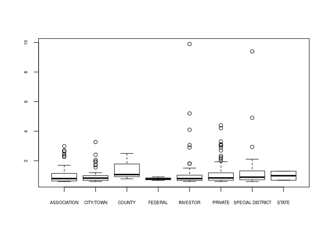
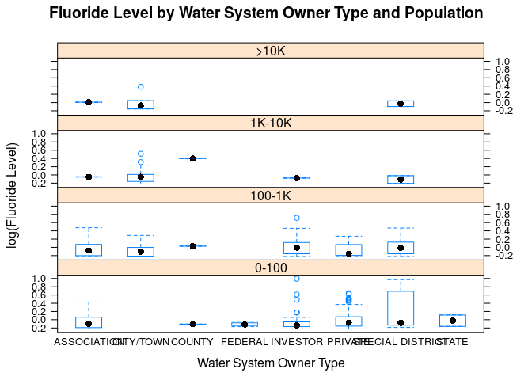
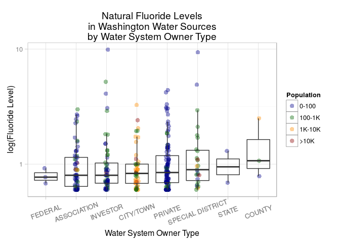
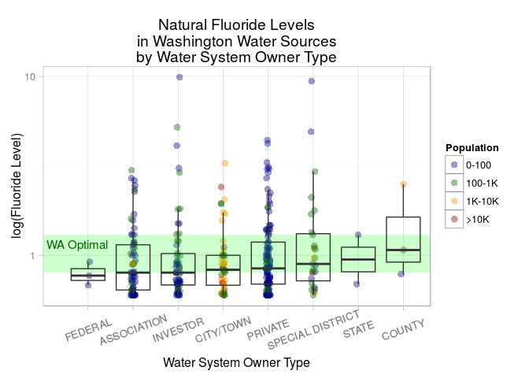
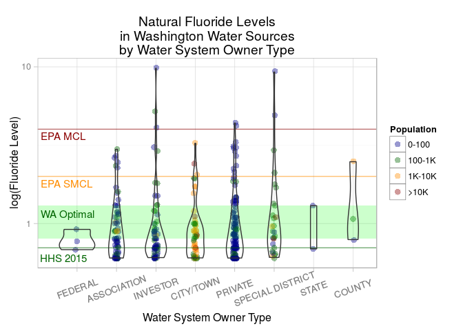
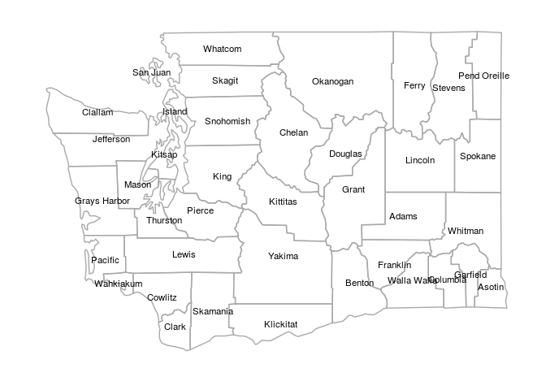
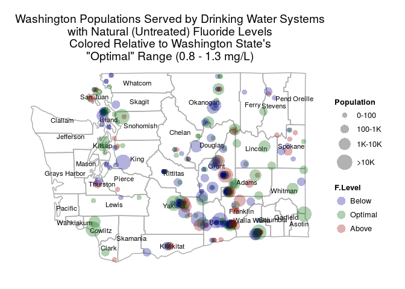

# Washington State Drinking Water Fluoridation
Brian High  
05/18/2015  

<a rel="license" href="http://creativecommons.org/licenses/by-sa/4.0/"></a><br />This work is licensed under a <a rel="license" href="http://creativecommons.org/licenses/by-sa/4.0/">Creative Commons Attribution-ShareAlike 4.0 International License</a>.

## Introduction

This project explores the use of publicly available data to investigate 
drinking water system fluoride levels in Washington State. Methods for 
reproducible data cleanup and exploratory analysis using R, RMarkdown, knitr, 
are demonstrated, as well as some of the plotting capabilities of ggplot2.

We will compare the various water systems in Washington State relative to the
state and federal recommendations for optimum levels of fluoride concentation 
in drinking water. In April 2015, the [US HHS](http://www.hhs.gov/news/press/2015pres/04/20150427a.html) ("Health Department")
released a lowering of the recommended fluoride concentration level from the 
previous range of 0.7 to 1.2 mg/L to the new 0.7 mg/L level, which falls below 
Washington State's [DOH ](http://www.doh.wa.gov/DataandStatisticalReports/EnvironmentalHealth/DrinkingWaterSystemData/FluorideinDrinkingWater) "optimal" range of 0.8 to 1.3 mg/L.

If Washington State follows this recommendation, what changes would need to be 
made to the state's water systems?

## Data Sources

Data files have been prepared using a companion 
[Markdown script](https://github.com/brianhigh/wa-water-quality/blob/master/data_cleanup_and_export.md) 
to generate text data files. These data and Markdown files are hosted in the 
[wa-water-quality](https://github.com/brianhigh/wa-water-quality) repository 
on [GitHub](https://github.com). https://github.com/brianhigh/wa-water-quality

The water system data come from [WA DOH Water System Data](http://www.doh.wa.gov/DataandStatisticalReports/EnvironmentalHealth/DrinkingWaterSystemData/DataDownload) (2015) and [WA DOH Fluoride in Drinking Water](http://www.doh.wa.gov/DataandStatisticalReports/EnvironmentalHealth/DrinkingWaterSystemData/FluorideinDrinkingWater) (2013). The lat/long coordinates were generated using the [ggmap](http://journal.r-project.org/archive/2013-1/kahle-wickham.pdf) package for R.

## Setup

Load the required R packages.


```r
for (pkg in c("knitr", "dplyr", "lattice", "ggplot2", "maps")) {
    if (! suppressWarnings(require(pkg, character.only=TRUE)) ) {
        install.packages(pkg, repos="http://cran.fhcrc.org", dependencies=TRUE)
        if (! suppressWarnings(require(pkg, character.only=TRUE)) ) {
            stop(paste0(c("Can't load package: ", pkg, "!"), collapse = ""))
        }
    }
}
```

Configure `knitr` options.


```r
opts_chunk$set(tidy=FALSE, cache=TRUE)
```

Create the data folder if needed.


```r
datadir <- "data"
dir.create(file.path(datadir), showWarnings=FALSE, recursive=TRUE)
```

Read in the location coordinates from a text file if you have saved one 
previously.


```r
tsv_import <- function(filename) {
    infile <- paste(c(datadir, '/', filename), sep='', collapse='')
    if (file.exists(infile)) {
        read.delim(infile, stringsAsFactors=FALSE, header=TRUE)
    }
    else {
        stop(paste("Can't find", filename, "in folder", datadir, "!", sep=" "))
    }
}

locations <- tsv_import('wa_doh_dw_locations.tsv')
systems <- tsv_import('wa_doh_dw_systems.tsv')
sources <- tsv_import('wa_doh_dw_sources.tsv')
```

```
## Warning in scan(file, what, nmax, sep, dec, quote, skip, nlines,
## na.strings, : EOF within quoted string
```

```r
fluoride <- tsv_import('wa_doh_dw_fluoride.tsv')
```

## Join Tables

Join the location and water system data into a new table for use in plotting.


```r
systems <- inner_join(locations, systems, by=c("PWSCity", "WSState", "WSZipCode"))
fl <- select(systems, PWSID, PWSCity, WSState, WSZipCode, 
                          OwnerTypeDesc, lon, lat)
fl$OwnerTypeDesc <- as.factor(fl$OwnerTypeDesc)

fl <- inner_join(fl, fluoride, by=c("PWSID"))
fl$Treatment <- as.factor(fl$Treatment)

# Add some grouping factors
fl$F.Level <- cut(fl$mgL, c(0, .8, 1.3, Inf), 
                  labels=c("Below", "Optimal", "Above"))
fl$Population <- cut(fl$ResPop, 
    c(0, 100, 1000, 10000, Inf), labels=c("0-100", "100-1K", "1K-10K", ">10K"))

nat.fl <- filter(fl, Treatment == "NATURAL")
nat.fl <- select(nat.fl, County, PWSID, SystemName, mgL, ResPop, OwnerTypeDesc, 
                 lon, lat, Treatment, F.Level, Population)

nat.fl <- nat.fl[complete.cases(nat.fl),]

nat.fl.high <- nat.fl[nat.fl$mgL>1.3,]
nat.fl.high <- nat.fl.high[complete.cases(nat.fl.high),]
```

### Boxplots

Let's get a first look at the data with some boxplots. We'll look at  
Washington State Drinking Water Systems with natural (non-fluoridated) fluoride 
concentration levels. Start with a basic boxplot of the Fluoride Level (mg/L) 
by Water System Owner Type.


```r
# Make a basic boxplot of mgL by Water System Owner Type
par(cex.axis=.55)
boxplot(mgL~OwnerTypeDesc, data=nat.fl)
```

 

As there is a lot of spread at the higher fluoride levels, we'll try using a log
scale for the y-axis.


```r
# Make a basic boxplot of mgL by Water System Owner Type
par(cex.axis=.55)
boxplot(mgL~OwnerTypeDesc, data=nat.fl, log="y")
```

 

As an alternative to the standard "base" plotting in R, we can use the `lattice`
plotting system. Here is a boxplot faceted by residental population groups
served by the water systems.


```r
bwplot(nat.fl$mgL~nat.fl$OwnerTypeDesc|nat.fl$Population,
        ylab="log(Fluoride Level)", xlab="Water System Owner Type", log="y",
        main="Fluoride Level by Water System Owner Type and Population",
        layout=(c(1,4)))
```

 

One of the most popular plotting systems in R is the versatile `ggplot2` 
package, which will be used for the rest of the plots in this document.

We will store the essential parameters of this next plot to build upon as we add 
more features to the plot.


```r
# Use grey colors, smaller x-asis lables, and use smaller outlier dots
plot <- ggplot(nat.fl, aes(x=OwnerTypeDesc, y=log(mgL))) + 
    labs(title=paste("Natural Fluoride Levels", "in Washington Water Sources", 
                     "by Water System Owner Type", sep="\n"), 
        x="Water System Owner Type", y = "log(Fluoride Level)") +
        theme_light() + coord_equal() + theme(axis.text.x = element_text(size=7)) 

plot + geom_boxplot(outlier.size=1)
```

 

Add points with jitter and colors for population groups. Remove the (now redundant) 
black outlier dots.


```r
# Add jittered and population-colored points
plot <- plot + geom_jitter(size=3, alpha=0.4, 
    position = position_jitter(width = 0.05), aes(color=Population)) +
    scale_color_manual(values=c("darkblue", "darkgreen", "darkorange", "darkred"))

plot + geom_boxplot(alpha=0.5, outlier.size=0)
```

 

Add a light-green horizontal band to show the optimal fluoride level range and 
add a label for it.


```r
# Add a rectangle for the optimal fluoride level range and a label for it
plot <- plot + geom_rect(data=nat.fl[1,], 
              aes(ymin=log(.8), ymax=log(1.3), xmin=0, xmax=Inf), 
              fill="green", alpha=.2, label="Optimal Fluoridation") + 
    geom_text(aes(8, 0, label="WA.Optimal", group=NULL), size = 4, 
        color = "darkgreen", data=nat.fl[1,], parse = T)

plot + geom_boxplot(alpha=0.5, outlier.size=0)
```

 

Add lines (and labels) for the various US HHS and EPA levels.


```r
# Add lines (and labels) for the various US HHS and EPA levels
plot <- plot + geom_hline(aes(yintercept=log(0.7), alpha=.5), color = "darkgreen") + 
    geom_text(aes(8, -.5, label="HHS.2015", group=NULL), size = 4, 
        color = "darkgreen", data=nat.fl[1,], parse = T) +
    geom_hline(aes(yintercept=log(2), alpha=.5), color = "darkorange") + 
    geom_text(aes(8, 0.8, label="EPA.SMCL", group=NULL), size = 4, 
        color = "darkorange", data=nat.fl[1,], parse = T) +
    geom_hline(aes(yintercept=log(4), alpha=.5), color = "darkred") + 
    geom_text(aes(8, 1.5, label="EPA.MCL", group=NULL), size = 4, 
        color = "darkred", data=nat.fl[1,], parse = T)

plot + geom_boxplot(alpha=0.5, outlier.size=0)
```

 

## Violin Plot of Natural Fluoride Levels

Make a violin plot of fluoride levels by system owner type. A violin plot is 
something like a box plot, except the width of the "violin" shape varies with 
the density of observations at each point along the y-axis. This will help us
see density differences where the dots overlap.


```r
# Make the violin plot
plot + geom_violin(alpha=0.3)
```

 

The colors indicate the size of the population served by the water system. 
The width of the shapes vary according to the density of points plotted at a 
given fluoride level. 

The light green band shows Washington's range of "optimal" 
fluoride levels (0.8 to 1.3 mg/L). The green line marks the new (April, 2015) 
[US HHS](http://www.hhs.gov/news/press/2015pres/04/20150427a.html) 
[recommended](http://www.cdc.gov/fluoridation/faqs/) level of 0.7 mg/L. 

The red line marks the level of the 
[US EPA](http://water.epa.gov/drink/contaminants/basicinformation/fluoride.cfm#four)'s 
MCLG (maximum contaminant level goal) of 4 mg/L. This is also the level of the 
EPA's enforceable MCL (maximum contaminant level). The orange line marks the 
level of the [US EPA](http://water.epa.gov/drink/contaminants/basicinformation/fluoride.cfm#four)'s SMCL (secondary standard) of 2 mg/L, a non-enforceable 
guideline. 

## Water Systems Fluoride over EPA MCL

Which systems are over the EPA MCL (maximum contaminant level) enforceable 
regulatory limit of 4 mg/L?


```r
nat.fl.over <- filter(nat.fl, mgL > 4)
nat.fl.over[order(nat.fl.over$mgL), c("SystemName", "OwnerTypeDesc", "ResPop", "mgL")]
```

```
##                          SystemName    OwnerTypeDesc ResPop  mgL
## 6                  WESTBOURNE ACRES         INVESTOR     94 4.10
## 1                      FROSTY PINES          PRIVATE     24 4.21
## 7          DALLES WATER ASSOCIATION          PRIVATE     21 4.40
## 4   DODD ROAD INDUSTRIAL PARK WATER SPECIAL DISTRICT      4 4.91
## 5 HARRISON-RAY-BURBANK WATER SYSTEM         INVESTOR    656 5.20
## 2        PATERSON ELEMENTARY SCHOOL SPECIAL DISTRICT      2 9.39
## 3       LONG LAKE OPERATORS VILLAGE         INVESTOR      7 9.89
```

One of the highest levels is PATERSON ELEMENTARY SCHOOL at 9.39 mg/L. That's over 
twice the EPA's regulatory limit of 4 mg/L. Looking at the 
[ResPop](http://www.doh.wa.gov/DataandStatisticalReports/EnvironmentalHealth/DrinkingWaterSystemData/DataDownload/DataTerms) column, the table lists the population as 2, 
yet the school's population of students is over 100 according to Washington 
[OSPI](http://reportcard.ospi.k12.wa.us/summary.aspx?schoolId=368&OrgType=4&reportLevel=School). What are the school's water sources?


```r
sources[sources$SystemName=="PATERSON ELEMENTARY SCHOOL", 
        c("SystemName", "Src_Name", "TrObjective", "TrProcss")]
```

```
##                      SystemName Src_Name TrObjective TrProcss
## 4935 PATERSON ELEMENTARY SCHOOL  WELL #1                     
## 4936 PATERSON ELEMENTARY SCHOOL  WELL #2
```

It looks like there is no treatment information available about those two wells.

Let's plot the water systems with fluoride levels over the EPA MCL as a simple 
bar plot, using the `theme_classic` theme.


```r
ggplot(nat.fl.over, aes(x=SystemName, y=mgL)) + coord_flip() +
    geom_bar(stat="identity", colour="darkred", fill="darkred", binwidth=1) +  
    ggtitle(paste("Washington State Drinking Water Systems",
                  "Exceeding EPA MCL of 4 mg/L", sep="\n")) +
    theme(axis.text.y = element_text(hjust = 1, size=10)) + theme_classic() +
    labs(y="Fluoride Level (mg/L)", x=NULL)
```

 

## Prepare Map Data

Prepare the map `data.frame` using the `map_data` function from the `ggplot2`
package.


```r
# Capitalize first letter of word - for use with proper nouns
# From documentation for `tolower` in package _base_ 3.1.3
capwords <- function(s, strict = FALSE) {
    cap <- function(s) paste(toupper(substring(s, 1, 1)),
                  {s <- substring(s, 2); if(strict) tolower(s) else s},
                             sep = "", collapse = " " )
    sapply(strsplit(s, split = " "), cap, USE.NAMES = !is.null(names(s)))
}

# Mappings of counties by state
county_df <- map_data('county')

# Subset just for WA
wa <- subset(county_df, region=="washington")
wa$subregion <- sapply(wa$subregion, function(x) capwords(x))
wa$county <- wa$subregion
cnames <- aggregate(cbind(long, lat) ~ subregion, data=wa, 
                    FUN=function(x)mean(range(x)))
```

This allows us to create a base state map with county border in grey that we 
will build upon later. We'll use the `theme_classic()` theme.


```r
# Create the base state map with counties outlined in grey
wamap <- ggplot(wa, aes(long, lat)) +  
    geom_polygon(aes(group=group), color='darkgrey', fill=NA) +
    geom_text(data=cnames, aes(long, lat, label = subregion), size=3) + 
    theme_classic()  + 
    theme(axis.line=element_blank(),
      axis.text.x=element_blank(),
      axis.text.y=element_blank(),
      axis.ticks=element_blank(),
      axis.title.x=element_blank(),
      axis.title.y=element_blank())
wamap
```

 

## Untreated Systems Exceeding Optimal Fluoride Levels

Make a map of populations Served by Drinking Water Systems with natural 
fluoride levels above Washington State's "optimal" range of 0.8 - 1.3 mg/L.


```r
# Make the map
wamap + geom_point(data=nat.fl.high, inherit.aes=F, 
               aes(x=lon, y=lat, size=Population), colour="darkred", alpha=.3) +
        scale_size_manual(values = seq(3, 12, by=2)) +
    guides(colour = guide_legend(override.aes = list(size=5))) + 
    ggtitle(label = paste("Washington Populations Served by Drinking Water Systems",
                          "with Natural (Untreated) Fluoride Levels", 
                          "Above Washington State's",
                          "\"Optimal\" Range (0.8 - 1.3 mg/L)", sep="\n"))
```

 

## Untreated Natural Fluoride Levels

Make a map of populations served by non-fluoridated water systems with natural 
fluoride levels.


```r
# Make the map
wamap + geom_point(data=nat.fl, inherit.aes=F, 
            aes(x=lon, y=lat, group=F.Level, color=F.Level, size=Population, 
                fill=F.Level), 
        position=position_jitterdodge(jitter.width=0.1, dodge.width=0.1), 
        alpha=.3) + scale_shape_discrete(solid=T) + 
    scale_size_manual(values = seq(3, 12, by=2)) +
    scale_color_manual(values=c("darkblue", "darkgreen", "darkred")) + 
    guides(colour = guide_legend(override.aes = list(size=5))) + 
    ggtitle(label = paste("Washington Populations Served by Drinking Water Systems",
                          "with Natural (Untreated) Fluoride Levels", 
                          "Relative to Washington State's",
                          "\"Optimal\" Range (0.8 - 1.3 mg/L)", sep="\n"))
```

 

## All Systems: Optimal and Nonoptimal Fluoride Levels

Make a map of populations Served by Drinking Water Systems with natural or treated 
fluoride levels falling inside or outside of Washington State's "optimal" range 
of 0.8 - 1.3 mg/L.


```r
# Assign Optimal as T/F based on fluoride concentrations (mgL) and system type
fl$Optimal <- with(fl, Treatment=="TREATED" | Treatment=="INTERTIED" | F.Level=="Optimal")

# Convert T/F to Yes/No
fl$Optimal <- factor(c('No', 'Yes')[fl$Optimal + 1])

# Subset the columns we want and remove incomplete observations
fl.opt <- select(fl, County, PWSID, SystemName, ResPop, OwnerTypeDesc, 
                 lon, lat, Treatment, Population, Optimal)
fl.opt <- fl[complete.cases(fl.opt),]

# Make the map
wamap + geom_point(data=fl.opt, inherit.aes=F, 
               aes(x=lon, y=lat, size=Population, color=Optimal), alpha=.3) +
    scale_size_manual(values = seq(3, 12, by=2)) +
    scale_color_manual(values=c("darkred", "darkgreen")) +
    guides(colour = guide_legend(override.aes = list(size=5))) + 
    ggtitle(label = paste("Washington Populations Served by Drinking Water Systems",
                          "with Fluoride Levels Relative to Washington State's",
                          "\"Optimal\" Range (0.8 - 1.3 mg/L)", sep="\n"))
```

 

## All Systems: US Recommended Fluoride Levels

Make a map of populations Served by Drinking Water Systems with natural or treated 
fluoride levels relative to US HHS ("Health Department") and US EPA guidelines.


```r
# Assign US.F.Level based on fluoride concentrations (mgL)
fl$US.F.Level <- cut(fl$mgL, c(-Inf, 0, .7, 2, 4, Inf), 
            labels=c("Unknown", "< HHS .7", "< EPA 2", "< EPA 4", "> EPA 4"))

# Assign remaining US.F.Levels for water systems without concentrations (mgL)
fl$US.F.Level[with(fl, Treatment=="TREATED" | Treatment=="INTERTIED")] <- "< EPA 2"
fl$US.F.Level[with(fl, Treatment=="MIXED")] <- "Unknown"

# Subset the columns we want and remove incomplete observations
fl.us <- select(fl, County, PWSID, SystemName, ResPop, OwnerTypeDesc, 
                 lon, lat, Treatment, Population, US.F.Level)
fl.us <- fl[complete.cases(fl.us),] # This removes the "Unknown" group

# Make the map
wamap + geom_point(data=fl.us, inherit.aes=F, 
            aes(x=lon, y=lat, group=US.F.Level, color=US.F.Level, 
                size=Population, fill=US.F.Level), 
        position=position_jitterdodge(jitter.width=0.1, dodge.width=0.1), 
        alpha=.3) + scale_shape_discrete(solid=T) + 
    scale_size_manual(values = seq(3, 12, by=2)) +
    scale_color_manual(values=c("blue", "darkgreen", "darkorange", "darkred")) +
    guides(colour = guide_legend(override.aes = list(size=5))) + 
    ggtitle(label = paste("Washington Populations Served by Drinking Water Systems",
                          "with Fluoride Levels Relative to",
                          "US HHS Recommendations and US EPA Standards", 
                          sep="\n"))
```

 
